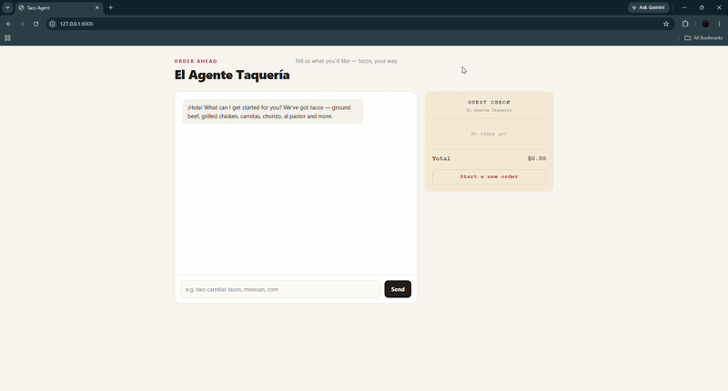
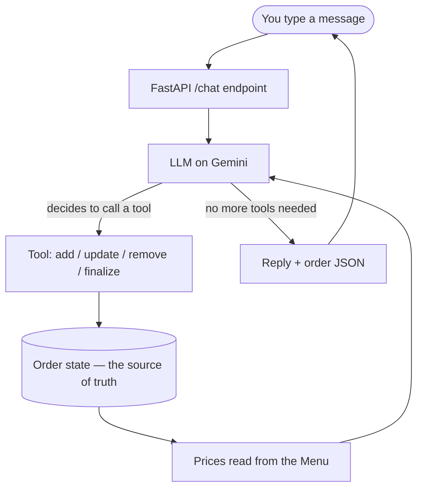

# Taco Ordering Agent

A conversational AI that takes a taco order the way a person actually talks — *"two carnitas, mexican style, corn… actually make one of them al pastor, and add guac"* — and turns it into a correct, structured order with a running total that can't drift.

The interesting part isn't that an LLM can chat. It's that **the order lives in real application code, not in the model's memory** — so the totals are computed, never guessed, and the agent can't hallucinate your bill.





---

## What it does

- Takes a multi-turn order in natural language and tracks it accurately across the whole conversation.
- Handles the messy realities of real ordering: changing quantities, removing items, editing toppings, asking *"what's on the al pastor?"*, and reading the order back before checkout.
- Computes every price server-side from a structured menu, so the total is always correct.
- Serves it all through a web app with a live order ticket that updates as you talk.

## Tech stack

`Python` · `LangChain / LangGraph` (tool-calling agent) · `Pydantic` (typed domain models) · `FastAPI` (REST service) · `Gemini API` (LLM inference, swappable provider) · vanilla JS front end

## Architecture

The system is deliberately split so the unreliable part (the language model) can only ever *talk*, while the reliable part (your code) owns the truth.



| File | Responsibility |
|------|----------------|
| `menu.py` | The menu as typed data — what exists and what it costs. |
| `order.py` | The order state: line items, stable IDs, running total. The single source of truth. |
| `tools.py` | The six functions the LLM is allowed to call. The only way the model can touch the order. |
| `agent.py` | Wires the model to the tools, runs the conversation loop, handles errors. |
| `api.py` | FastAPI service with per-session state isolation, plus the web UI. |
| `eval.py` | Automated test harness that asserts on final order state. |

## Design decisions

These are the choices I'd want to talk through in an interview.

**Order state lives in code, not the model.** The LLM never does arithmetic or remembers the order in its context. It calls tools; the `Order` object computes the total from the menu. This is what makes the output trustworthy — the model can phrase things however it likes, but it cannot produce a wrong price.

**Tools return human-readable results, including errors.** When the model passes a bad argument, the tool replies with a helpful message listing valid options, so the model can self-correct on the next step instead of failing silently.

**Stable per-line IDs instead of list positions.** Each item gets a permanent ID that never renumbers. Removing item #2 leaves #1 and #3 untouched, so any reference the model is holding stays valid — the same reason databases use primary keys instead of row numbers.

**Model-agnostic by design.** Swapping between Anthropic, Gemini, and Groq is a one-line change, backed by a normalized error layer that detects rate limits across providers regardless of which SDK raised them. The app logic doesn't care which model is behind it.

**Evals assert on state, not text.** The test harness replays scripted conversations through the live agent and checks `order.total()` directly — never the model's wording. That makes the tests robust to phrasing changes and turns "it worked when I tried it" into something repeatable.

**Per-session isolation for concurrency.** The web service keys each browser's order and history by a session ID, so many users can order at once without colliding.

## Getting started

Requires Python 3.10+ and a free [Gemini API key](https://aistudio.google.com/apikey).

```bash
git clone https://github.com/Hari-31/taco-agent.git
cd taco-agent

python -m venv .venv
source .venv/bin/activate          # Windows: .venv\Scripts\Activate.ps1

pip install -r requirements.txt
```

Create a `.env` file in the project root:

```
GOOGLE_API_KEY=your-key-here
```

Run the web app:

```bash
uvicorn api:app --reload
```

Then open **http://127.0.0.1:8000** and start ordering. You can also try the agent in the terminal with `python agent.py`.

## Testing

```bash
python eval.py
```

Runs a set of scripted multi-turn orders through the real agent and checks that each one ends in the correct order state and total.

## Roadmap

- [ ] Containerize with Docker and deploy to AWS for a public live demo
- [ ] Fast unit-test suite (pytest) for the core order logic, plus CI
- [ ] Voice ordering — a speech layer that feeds the same backend, so none of the core logic changes
- [ ] Semantic menu search with embeddings, to scale past a small menu

## About

<!-- TODO: make this yours -->
Built by **Hari Krishna Reddy Padala** as a hands-on study in shipping reliable LLM products.

[LinkedIn](https://www.linkedin.com/in/padala-hari-krishna-reddy/)
